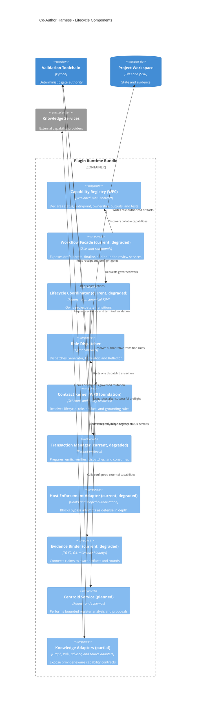

# Lifecycle component architecture

**Status:** Target component architecture. Components marked **planned** are
not active capabilities until `references/capabilities.yaml` says otherwise.

## Required dependency direction

`capability registry -> workflow facade -> lifecycle coordinator -> contract
kernel -> transaction manager -> deterministic gates -> role-owned artifact ->
evidence binding -> human approval -> atomic Planner state transition`.

No receipt-bound input may change between receipt emission and dispatch.
