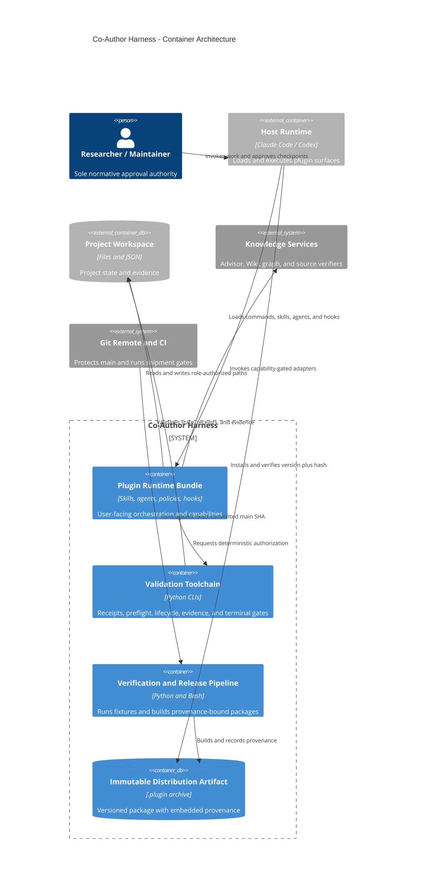

# Co-Author Harness containers

**Status:** Target container architecture. `Plugin Runtime Bundle`, `Validation
Toolchain`, and `Verification and Release Pipeline` exist today. The repair
programme changes their contracts and connections rather than pretending they
are new deployable services.

## Deployment invariant

Version equality is necessary but insufficient. An installed host copy must
also match the immutable distribution artifact's provenance and content hash.
