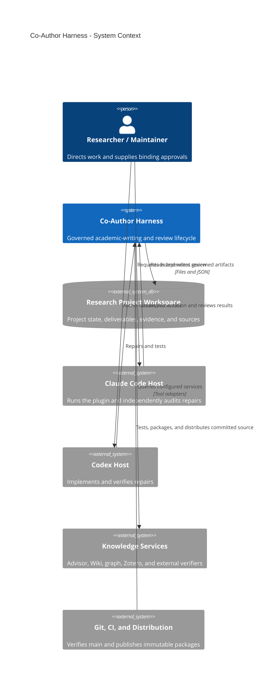

# Co-Author Harness system context

**Status:** Target architecture approved for the repair programme. The diagram
shows the intended system boundary; capability availability remains governed by
`references/capabilities.yaml` and must not be inferred from this diagram.

## Boundary rules

- The researcher is the sole normative approval authority.
- Codex and Claude are external maintainers, not product lifecycle roles.
- Source checkout, built archive, Claude installation, and Codex installation
  are distinct deployment instances.
- Project evidence and release evidence belong to different trust domains.
