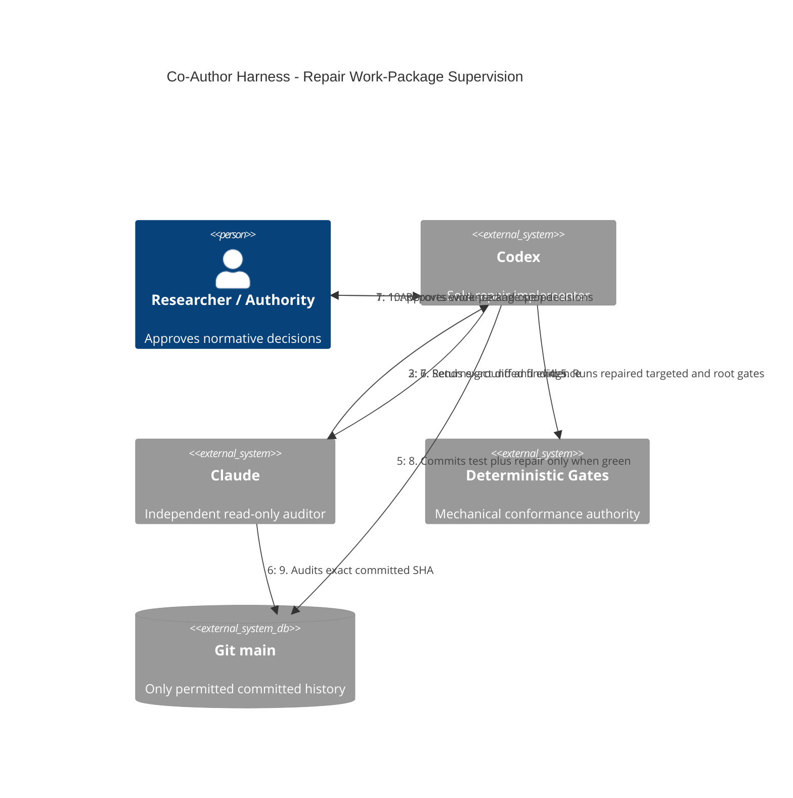

# Codex-Claude supervision flow

**Status:** Ratified by the researcher on 2026-07-19 and binding for this repair
programme through `docs/repair/mutual-supervision.md`. It governs package
repair, not academic manuscript production.

Mechanical disputes are decided by a minimal synthetic fixture authored by the
challenger and run unchanged by the implementer. Contract conflicts return to
the researcher; neither agent silently chooses a preferred authority.
