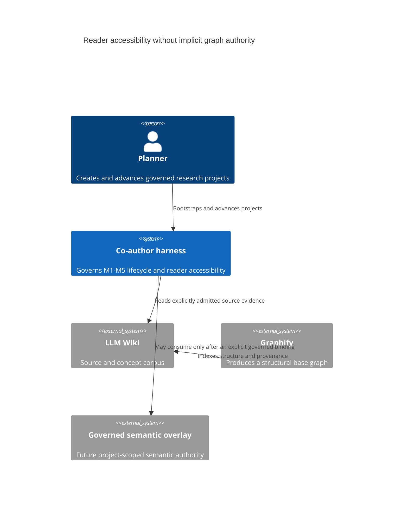
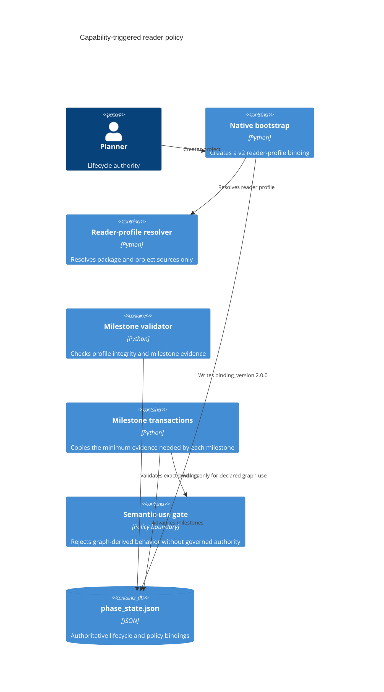

# Reader-policy and semantic-graph decoupling

## Context

The lifecycle must not infer semantic authority from Graphify's structural output. A project can establish its intended readers, source lexicons, terminology, and prose constraints without a graph. Graph-dependent behavior is a separate capability and remains unavailable unless an explicit governed semantic binding exists.

## Containers

## Binding contract

`reader_accessibility.binding_version: 2.0.0` binds only:

- the canonical profile and its hash;
- the written resolved profile and its hash;
- scoped package/project source bindings;
- project identity and transition history;
- `semantic_usage: not_invoked`.

No structural graph hash, semantic-view pin, or register provenance is present in this binding. M1 and M2 therefore depend only on reader/source evidence. M3-M5 inherit the same three stable profile fields plus `semantic_usage`. Any future graph-derived claim must change semantic usage through a separate governed transaction; until that authority exists, the semantic-use gate remains fail-closed with `GRAPH_GOVERNED_GENERATION_UNAVAILABLE`.

Assignment dispatch and draft governance read the same binding. For v2 they record `exemplar_conditioning: false`, omit the centroid generation/evaluation obligation, and retain the remaining scholarly, receipt, approval, and lifecycle gates. Direct centroid-service calls still fail closed; the ordinary workflow does not reinterpret their absence as a lifecycle failure.

Accepted M4/M5 work uses `check8_evidence.v2`, which binds the reader profile, manuscript, phase, cycle, transition snapshot, and deterministic A-H findings while declaring `semantic_usage: not_invoked`. The v2 schema rejects semantic-view pins. Legacy semantic projects continue to use `check8_evidence.v1` with both pins.

Legacy semantic v1 bindings remain valid for existing projects. Legacy `semantic_graph_unavailable` bindings require an explicit, receipted migration to v2; validation never silently rewrites governed state.

## Migration and rollback

The Planner migration transaction verifies the old phase-state and resolver hashes, writes the v2 resolver artifact, validates the proposed state, and publishes an applied receipt containing pre/post hashes. Any failure restores the exact preimage bytes and removes a partial receipt. This makes the migration reversible and auditable without granting the structural graph semantic authority.
