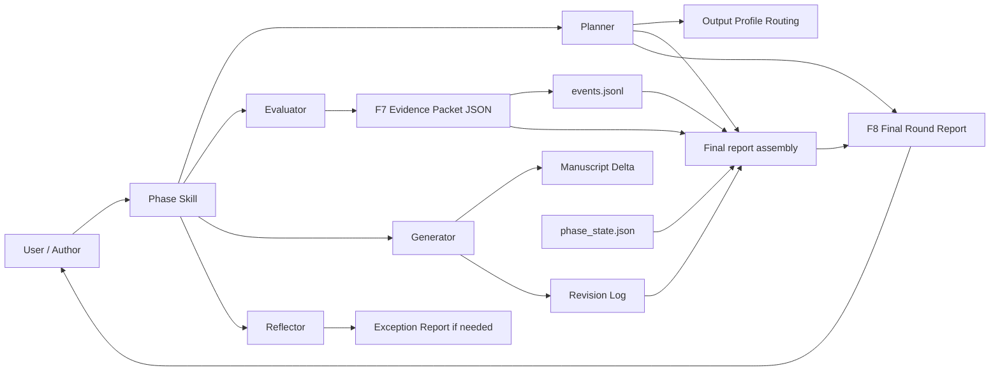

# Architecture: Output Economy Layer

**Status:** Draft for review  
**Scope:** `co-author-harness` plugin  
**Related plan:** [`docs/superpowers/plans/2026-05-04-output-economy-overhaul.md`](docs/superpowers/plans/2026-05-04-output-economy-overhaul.md) (repo-relative path; same tree under `co-author-harness/`)  
**Target version:** v0.14.0  

## 1. Problem

The harness currently spends too much of each phase producing reader-facing governance artifacts. Those artifacts preserve auditability, but they make the workflow slower and move attention away from the paper. The manuscript-changing work happens during the phase, while the most visible result is often a stack of reports.

The architecture should keep the phase ladder, grounding discipline, and audit trail, but change the default output economy. Ph1 through Ph3 should move the manuscript, update compact state, and save machine-readable evidence. Ph4 or explicit round close should assemble the reader-facing synthesis.

## 2. Architecture Decision

Add an **Output Economy Layer** over the existing phase ladder.

The existing phase ladder remains the intellectual workflow. The new layer controls what each phase emits by default:

- Manuscript movement is the primary product.
- Evidence packets replace routine intermediate reports.
- Human-facing reports are reserved for decisions, blockers, failures, explicit user requests, and final round synthesis.
- Legacy report paths remain readable through compatibility pointers.

This is an output-contract change, not a rewrite of the four-agent model.

## 3. Core Concepts

### Round

A round is one coherent multi-phase run over a manuscript or section. It may include Ph1, Ph2, Ph3, Ph3 stability, and Ph4.

`round_id` names the round:

```text
round_YYYY-MM-DD_NNN
```

Example:

```text
round_2026-05-04_001
```

### Event

An event is one evidence-producing action inside a round: a phase check, segment check, exception, clean admission, or final assembly input.

`event_id` names the event:

```text
<round_id>__<phase-or-event-kind>__NNN
```

Example:

```text
round_2026-05-04_001__ph2__001
```

The final report uses the `round_id`, never a phase event ID.

### Output Profile

An output profile tells an agent or phase what to emit.

| Profile | Human-facing by default | Use |
|---|---:|---|
| `silent_evidence` | No | Routine checks, clean passes, deterministic verification, reduced-envelope phases. |
| `decision_checkpoint` | Yes | User approval, scope choice, phase gate, or blocker decision. |
| `final_report` | Yes | Ph4 or explicit round close. |
| `exception_report` | Yes | Unsafe edit condition, verifier failure, missing evidence, or unrecoverable state drift. |

## 4. Component Model



## 5. Responsibilities

### Phase Skills

Phase skills own phase-specific sequencing. They decide which checks run and when phase gates advance.

They do not own report proliferation. Each phase skill must declare an output profile and default to the smallest sufficient output:

- `manuscript/main.md` or the target manuscript file when edits are made.
- `manuscript/revision_log.md` for compact edit history.
- `reviews/phase_state.json` for phase state.
- `reviews/.harness/evidence/<event_id>.json` for check evidence.
- Human-facing output only for decisions, exceptions, and final synthesis.

### Planner

Planner owns output-profile routing and final report assembly.

Planner chooses the active `round_id`, assigns event identifiers, routes phases into `silent_evidence`, `decision_checkpoint`, `final_report`, or `exception_report`, and assembles the final report at Ph4 or explicit round close.

Planner also owns backward compatibility. If an in-progress project expects a legacy report path, Planner writes a pointer instead of duplicating the report.

### Evaluator

Evaluator owns check evidence and action lists.

Evaluator writes F7 evidence packets and returns short action lists focused on manuscript movement:

1. BLOCKER actions.
2. MAJOR actions.
3. Count of MINOR polish findings.
4. Evidence packet path.

Full Markdown findings are exception outputs, not routine outputs.

**SAFEGUARD and gates.** Phase gates and SAFEGUARD checks consume **F7 JSON**, `reviews/phase_state.json`, and legacy F1–F6 Markdown where still produced. Treat F7 plus the Evaluator’s short action list as the default substrate for gating; reserve full Markdown F1-style findings for explicit exceptions (blocker adjudication, user request, or verifier contracts that still require a prose artefact).

### Generator

Generator owns manuscript deltas and compact revision-log entries.

Generator should report what changed, what approved action was completed, what was skipped, and why. It should not create reader-facing findings reports.

### Reflector

Reflector-lightweight runs during Ph1 through Ph3 only when integrity checks, blockers, or verifier failures require reflection. Reflector-full runs at Ph4 or explicit round close as part of final synthesis and learning.

## 6. Artifact Contracts

### Primary Manuscript Artifacts

These remain the author-facing source of truth:

- `manuscript/main.md` or the relevant manuscript file.
- `manuscript/revision_log.md`.
- `reviews/phase_state.json`.

### F7 Evidence Packet

F7 is JSON, not Markdown. It is validated through a JSON validation path.

Path:

```text
reviews/.harness/evidence/<event_id>.json
```

Required shape:

```json
{
  "artifact_family": "F7",
  "document_type": "evidence_packet",
  "round_id": "round_2026-05-04_001",
  "event_id": "round_2026-05-04_001__ph2__001",
  "phase": "Ph2",
  "target": "manuscript/main.md#section",
  "evidence_status": "complete",
  "created_at": "2026-05-04T00:00:00Z",
  "checks_run": [],
  "blockers": [],
  "major_actions": [],
  "minor_actions_count": 0,
  "manuscript_delta_summary": "",
  "state_updates": {},
  "source_reads": [],
  "final_report_inputs": {
    "checks_skipped": [],
    "baseline_metrics": {},
    "notes": []
  }
}
```

**Formal contract.** Required vs optional fields, enums, and `additionalProperties` policy for F7 are normative in `references/OUTPUT_ECONOMY_PROTOCOL.md` §3 and duplicated for machine tools in `references/schemas/f7_evidence_packet.schema.json`. The F8 body section order is normative in `references/templates/final_round_report.md`.

`evidence_status` is one of:

- `complete`
- `partial`
- `incomplete`

### Event Log

The event log is append-only.

Path:

```text
reviews/.harness/events.jsonl
```

**Risk note (non-goal v0.14.0).** A single append-only log can grow large; concurrent append without coordination is undefined. Per-round log sharding or rotation is deferred.

Each line records a round event:

```json
{"round_id":"round_2026-05-04_001","event_id":"round_2026-05-04_001__ph2__001","timestamp":"2026-05-04T00:00:00Z","phase":"Ph2","event":"evidence_packet_written","path":"reviews/.harness/evidence/round_2026-05-04_001__ph2__001.json"}
```

### Cache

The cache stores reusable deterministic results keyed by content hash.

Path:

```text
reviews/.harness/cache/<content_hash>.json
```

The cache may speed repeated checks. It must not replace evidence packets for final report assembly.

### F8 Final Round Report

F8 is Markdown with YAML frontmatter.

Path:

```text
reviews/final_round_report_<round_id>.md
```

Required frontmatter:

```yaml
---
artifact_family: F8
document_type: final_round_report
round_id: round_2026-05-04_001
evidence_status: complete
created_at: 2026-05-04T00:00:00Z
---
```

The body summarizes:

- Paper delta.
- Quality movement.
- Evidence packets read.
- Verifiers used.
- Checks skipped with reason.
- Next actions.

## 7. Runtime Flow

### Normal Phase Flow

1. Planner resolves or creates `round_id`.
2. Phase skill declares output profile.
3. Evaluator runs checks and writes F7 evidence.
4. Generator applies approved manuscript changes.
5. Generator updates `manuscript/revision_log.md`.
6. Phase skill updates `reviews/phase_state.json`.
7. Phase emits a short checkpoint only when the user needs to see or decide something.

### Final Report Flow

1. Planner reads `reviews/.harness/events.jsonl`.
2. Planner filters events for the active `round_id`.
3. Planner loads each referenced F7 evidence packet.
4. Planner merges evidence with `manuscript/revision_log.md` and `reviews/phase_state.json`.
5. Planner writes F8 Markdown to `reviews/final_round_report_<round_id>.md`.
6. If evidence is missing, Planner marks the report `evidence_status: incomplete` and writes an exception report or compatibility pointer as needed.

### Exception Flow

An exception report is allowed when:

- The user must approve a blocker decision.
- A verifier fails.
- The manuscript cannot be changed safely.
- Required state is missing or contradictory.
- A legacy project requires a human-readable report path.
- The user explicitly asks for the full report.

Exception reports should name the replacement evidence packet and final report path when possible.

## 8. Validation Architecture

### Artifact Validator

`scripts/artefact_frontmatter_validate.py` needs two validation lanes:

- Markdown lane for existing F1 through F6 artifacts and F8 final reports.
- JSON lane for F7 evidence packets.

The validator dispatches by file suffix:

- `.md` uses YAML frontmatter extraction.
- `.json` uses JSON parsing and object-field validation.

F7 and F8 do not use the legacy F1 through F6 `COMMON_REQUIRED` fields. They use their own required and allowed fields because they use `round_id` and `event_id`, not legacy `cycle_id`.

### Output Economy Validator

`scripts/output_economy_check.py` prevents report-heavy defaults from returning.

It checks:

- Phase skills include output-profile language and evidence paths.
- Planner includes output-profile routing.
- Agent contracts describe evidence packets and final reports.
- Discouraged report-default phrases appear only inside exception or compatibility sections.

Allowed discouraged sections are determined by Markdown heading-depth traversal, not loose string matching.

**Example (heading-depth allowance).** The phrase `per-step findings` is **forbidden** in default phase prose. It is **allowed** only under a heading whose title matches the exception pattern, until the next heading of the same or higher `#` depth:

```markdown
## Output Profile
… routine instructions …

### Exception report surfaces
When a verifier fails, you may still emit per-step findings in Markdown for user adjudication.
```

### Smoke Test

`scripts/output_economy_smoketest.py` simulates a small Ph2-style event and verifies:

- F7 evidence packet is generated.
- `events.jsonl` references the same `round_id` and `event_id`.
- F8 final report is assembled.
- `artefact_frontmatter_validate.py` accepts both F7 and F8 fixture artifacts.
- Routine `consolidated_findings_report.md` and `ph2_findings_*` reports are not produced.
- A compatibility pointer can be generated at a legacy path.

## 9. Compatibility And Migration

New rounds use the output-economy contract by default.

Existing in-progress projects may still expect paths such as:

```text
reviews/consolidated_findings_report.md
```

For those projects, the harness writes a small pointer at the legacy path instead of duplicating a full report:

```markdown
# Compatibility Pointer

This project now uses output-economy reporting.

Replacement evidence: `reviews/.harness/evidence/<event_id>.json`
Final synthesis: `reviews/final_round_report_<round_id>.md`
```

**Which evidence file to cite** when many F7 packets exist for one round: use the latest `evidence_packet_written` row for that `round_id` in `events.jsonl`; if the log is empty, use the lexicographically greatest on-disk `event_id` under `reviews/.harness/evidence/` with that `round_id` prefix. See `references/OUTPUT_ECONOMY_PROTOCOL.md` §9.1.

Legacy reports that already exist may be treated as legacy evidence sources during final synthesis. The final report should mark them as legacy sources.

## 10. Efficiency Metrics

The architecture adds output-economy metrics to the existing efficiency substrate:

- Time-to-next-draft.
- Evidence-to-output ratio.
- Accepted-action yield.
- Report deferral compliance.
- Human-facing report default count.
- Legacy report path mention count.
- Evidence packet mention count.

Baseline capture must merge new keys into the existing `.plugin-efficiency.json` root object. It must not replace the file or erase historical model, threshold, rebase, or false-positive context.

## 11. Implementation Mapping

| Architecture Area | Implementation Plan Tasks |
|---|---|
| Intent layer | Task 2 |
| Output contract | Task 1 |
| Artifact schema and identifier rules | Task 3 |
| Core protocol consumers | Task 4 |
| Phase skill behavior | Task 5 |
| Agent contract behavior | Task 6 |
| Final report and compatibility | Task 7 |
| Validators and smoke test | Task 8 |
| Efficiency baseline and targets | Task 9 |
| Release verification | Task 10 |

Implementation should keep this order. Do not change phase-skill runtime behavior before the protocol, schema, identifier contract, and baseline measurement are in place.

## 12. Non-goals

- Do not remove the phase ladder.
- Do not weaken grounding or phase-state validation.
- Do not delete legacy artifacts during migration.
- Do not make the final report the only evidence source.
- Do not require users to read machine evidence unless they ask or a dispute requires it.

## 13. Open Decisions

No open architecture decisions remain for v0.14.0.

**Implementation may still set operational defaults** not enumerated here (for example maximum read size for `events.jsonl` during assembly, or recommended F7 file size limits), provided they do not change F7/F8 required fields, identifier formats, or the default output-economy behavior without a versioned schema bump.

The implementation plan may still make local wording choices inside individual files, but the contracts in this architecture are fixed:

- F7 is JSON.
- F8 is Markdown with frontmatter.
- `round_id` names the round.
- `event_id` names evidence events.
- Routine reports are deferred.
- Compatibility uses pointers, not duplicate reports.

## 14. Self-Review

- [x] No unresolved placeholders.
- [x] F7 and F8 artifact types do not conflict.
- [x] Identifier contract is explicit.
- [x] Validator lanes are separate.
- [x] Compatibility behavior is non-destructive.
- [x] Implementation mapping aligns with the overhaul plan.
