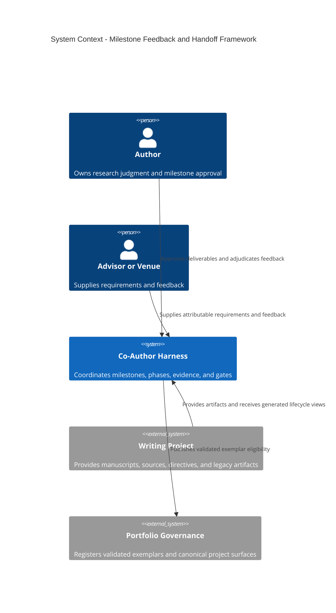
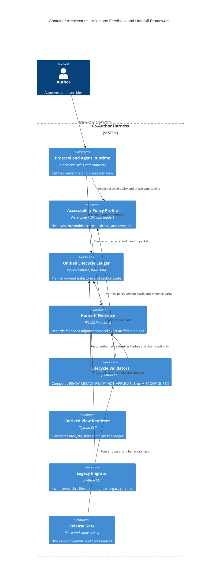
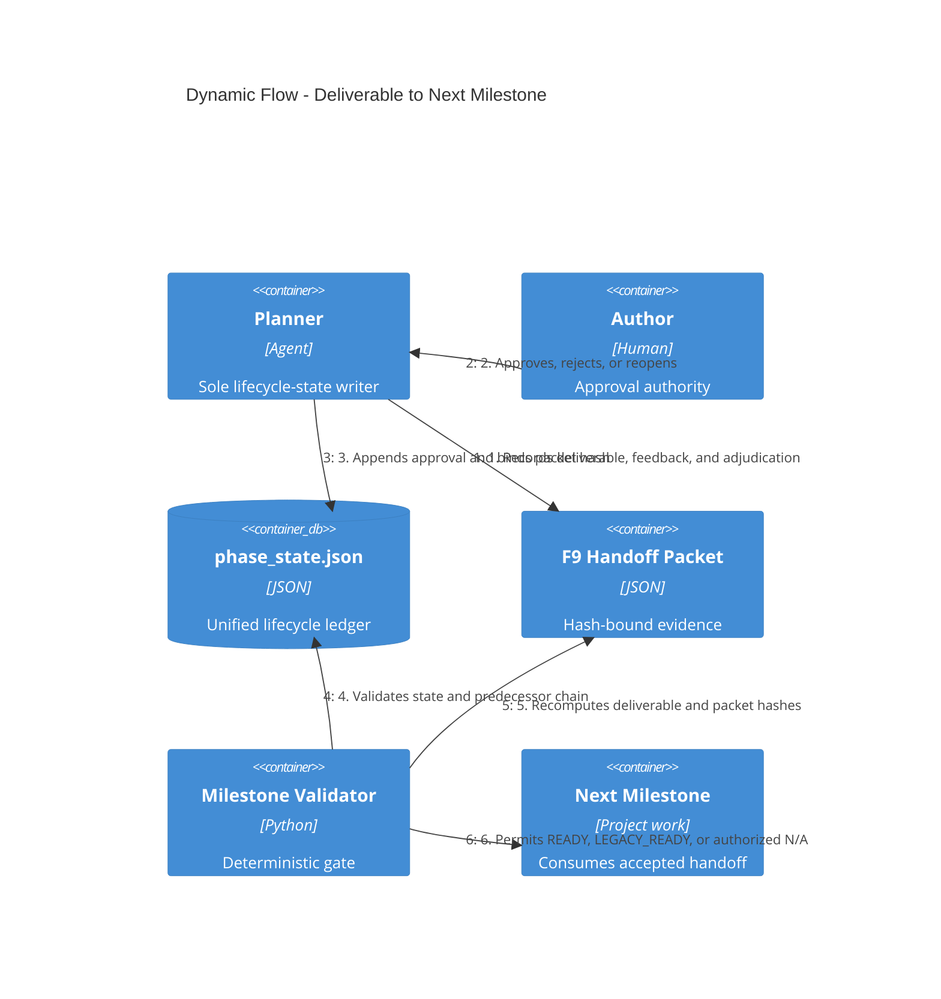

# Architecture: Milestone Feedback and Handoff Framework

**Status:** Accepted and implemented
**Approval provenance:** User approval in session on 2026-07-13; implementation record refreshed 2026-07-14
**Scope:** `co-author-harness` project lifecycle
**Design case:** QE2026 first-principles RE essay M4/M5 handoff failure
**Migration case:** INF3130_HCI legacy milestone tree and malformed mixed ledger
**Related plan:** `docs/superpowers/plans/2026-07-13-milestone-feedback-framework-implementation.md`
**Implemented release:** `0.28.0`

## 1. Decision

The harness will govern writing projects on two orthogonal axes:

- **Milestones M1-M5** govern project-level deliverables, feedback, decisions, provenance, and handoffs.
- **Phases Ph1-Ph4** govern the revision and readiness state of the active manuscript or manuscript sections.

Neither axis supersedes the other. M1-M3 normally occur during Ph1; M4 is developed and reviewed through Ph2-Ph3; M5 is finalized at Ph4. The mapping coordinates the axes but does not collapse them.

The single machine-readable authority remains `reviews/phase_state.json`. A new top-level `milestone_framework` namespace records milestone state. Human-readable lifecycle summaries are generated views and never independent authorities.

## 2. Problem and evidence

### 2.1 Design failure: the RE essay

The RE essay exposed the missing invariant. Its milestone chain named a revision plan as M4 and a convergence checklist as M5. The resulting sequence was:

`project memo -> annotated references -> outline -> revision plan -> checklist`

The manuscript sat beside the chain rather than being produced at M4 and certified at M5. The repair established the governing invariant:

`deliverable -> feedback/control -> adjudication -> hash-bound handoff -> next deliverable`

M4 and M5 may bind the same canonical manuscript path, but at different maturity depths and with different acceptance criteria. A plan, gate, checklist, or review may block, reopen, or support a milestone; it cannot substitute for the milestone deliverable.

### 2.2 Migration evidence: INF3130_HCI

INF3130 must not supply the normative lifecycle design. It is a useful legacy migration case because it contains:

- divergent archive and live M1/M3 lineages;
- direct M3 feedback, a retrospective M1 audit, cross-cutting guidance, and review evidence that cannot truthfully be called direct feedback for every milestone;
- a `phase_state.json` whose `sections` value is an array although the live schema requires an object;
- a simultaneous legacy `tier_state.json`, producing mixed-state drift;
- a Ph3 layperson sibling that prevents all-section MCR admission;
- stale path and generated-view claims.

The live phase-state validator currently returns `DOC_SECTIONS_NOT_OBJECT` at BLOCKER and `MIXED_STATE` at MAJOR. INF3130 therefore becomes a negative and migration fixture until it is migrated, validated, and explicitly registered as a `legacy_migration_exemplar`.

## 3. Non-negotiable principles

1. **One authority.** `reviews/phase_state.json` is the only lifecycle state authority. Generated Markdown carries a source hash and a do-not-edit marker.
2. **Two axes.** Milestones govern deliverables and dependencies; phases govern revision/readiness.
3. **Deliverables are not controls.** Plans, gates, checklists, reviews, and reports cannot occupy M1-M5 deliverable slots.
4. **Exact artifact identity.** Accepted deliverables and handoffs bind canonical path, SHA-256, byte count, and verification time.
5. **Typed provenance.** Artifact lineage and feedback provenance are separate structures. Neither is inferred from filenames.
6. **Hash-bound approval.** M4/M5 approval certifies exact bytes. Changed bytes make the approval historical.
7. **No erased history.** Reopening appends an event and marks dependencies stale; it never rewrites old approval as if it certified current bytes.
8. **Planner sole writer.** Validators, renderers, Evaluator, Generator, and Reflector read state but do not mutate it.
9. **Explicit applicability.** Absence is misconfiguration, never implicit legacy or implicit N/A.
10. **No self-declared exemplars.** Exemplar status is granted by a validated harness/portfolio registry.

## 4. Authority and precedence

Grounding, provenance integrity, and root filesystem safety are non-overridable boundaries. Within those boundaries, milestone content and form follow:

1. Current user instruction.
2. Venue requirement.
3. Advisor, instructor, or committee requirement.
4. Project-local `AGENTS.md`, `CLAUDE.md`, `directives.md`, and declared project profile.
5. `MILESTONE_FEEDBACK_HANDOFF_PROTOCOL.md` and the phase protocol.
6. General package defaults.

Project-level specialization may:

- change deliverable format;
- add exit criteria or feedback gates;
- map venue-named deliverables to M1-M5 semantic roles;
- mark a milestone not applicable when a higher-authority record gives a reason and substitute evidence;
- narrow which manuscript sections or lineages are in scope.

Project-level specialization may not:

- relabel a control or checklist as a milestone deliverable;
- change schema meanings;
- fabricate or reclassify provenance;
- rewrite recorded history;
- bypass Grounding or filesystem-integrity rules;
- waive a blocking gate without an append-only authorized override record.

An override record contains rule, scope, authority, rationale, timestamp, affected milestones/handoffs, and revalidation obligations.

### 4.1 Reader-accessibility policy ownership

Reader accessibility is a cross-cutting dependency of M1, M3, M4, M5, Ph2, Ph3, and Ph4. It therefore cannot depend on an unverified external pointer or on independently repeated prose thresholds.

The current package has a dangling authority chain. `STYLE_COMMITMENTS.md`, `READER_ACCESSIBILITY.md`, the Evaluator, and the overlay cite “Hard Constraint #8” in a Ph.D.-root `CLAUDE.md` §9/§13. The live `B:\Agents\research\Ph.D. Research\CLAUDE.md` is now a short pointer to `AGENTS.md`; neither live file contains that numbered definition. The package itself contains the operational policy but no enumerated Hard Constraints list. The target architecture therefore makes the package policy self-contained:

- `references/READER_ACCESSIBILITY.md` owns the normative C-5 policy meaning and anti-dilution rule;
- `references/policies/reader_accessibility.v1.json` owns machine-consumed thresholds, phase applicability, aggregation, lexicon routing, override polarity, and remediation ordering;
- `references/schemas/reader_accessibility_profile.schema.json` validates the policy profile and project-resolved profile;
- prose surfaces explain or cite the profile; they do not independently define numeric values;
- scripts and the accessibility overlay load the same resolved profile;
- an external portfolio rule may strengthen the package baseline, but package operation never requires an external file to reconstruct its meaning.

Current evidence also establishes five repair requirements:

1. Thresholds such as 150/200-word cadence, mean sentence length above 28 with standard deviation below 6, the 20-word shortest-sentence warning, P0/P1/P2 jargon caps, the three-construct boundary, and the 3,000/5,000-word envelope are repeated across policy, overlay, safeguard, and deterministic surfaces. A contract-parity test must reject divergence.
2. The 200-word cadence rule is currently inconsistent: the deterministic/sub-check surfaces flag every paragraph above 200 words, while `SAFEGUARD_LAYER.md` permits one with two turn-points. The profile must choose one rule through user adjudication before release; implementation must not silently select either interpretation.
3. Per-project hedge, connective, and Latinate-whitelist overrides were documented for v0.10.3 but remain unloaded at package v0.27.0. The resolved-profile loader must implement and provenance-bind them. Hedge and plain-connective lists use replacement semantics; the exemption-bearing Latinate whitelist uses additive semantics.
4. Sub-check H can recommend an em dash as a register-shift marker while deterministic style checks penalize it. The profile must encode remediation order: semicolon for contrast, colon for specification, explicit signpost phrase, and em dash only when the resolved style profile permits it.
5. The built-in domain-token exclusions are calibrated to i*, GORE/AORE, and HCI. They are seed examples, not universal ontology. Project terminology registers and glossaries must drive portability, and every resolved exclusion set must record its sources.
6. The overlay and Evaluator still describe Check 8 as A–H, while `SAFEGUARD_LAYER.md` now also contains an advisory Sub-check J. The profile must enumerate the active set and the gate contribution of each Sub-check. Release is blocked until J is either integrated across dispatch/overlay/aggregation or explicitly classified as a separate advisory outside the A–H Check 8 contract.
7. The G prefilter uses word/paragraph-gap proxies, including `para_count > 6`, rather than implementing the normative three-construct dependency trigger. Proxies may nominate candidates but cannot be labeled as the policy predicate. Output must identify `probe_kind: proxy` and the overlay must perform the construct/dependency judgment before verdict.
8. `lay_term_lexicons.md` claims an implemented `_corpus_drift` probe, but no such script probe exists. The release must either implement and dispatch it or downgrade the claim to a planned requirement.
9. Project-specific April 2026 grace periods and `advisory_until` counters are fossilized in normative prose. Their meanings belong in the versioned profile; their live values and retirement events belong in `phase_state.json.milestone_framework.policy_bindings.reader_accessibility`, not in prose or a second classification authority.

Three intellectual invariants survive the consolidation unchanged: Sub-check H judges the presence of positive register markers rather than punishing negative markers; local A–F, cumulative G, and register H remain distinct scales; and accessibility cannot silently flatten authorial voice (C-7) or strip protected analytic constructions (C-8). A conflict among C-5, C-7, and C-8 is surfaced for adjudication with rule-specific evidence.

The verified numeric posture is:

| Rule | Current live surfaces | Posture |
|---|---|---|
| Cadence above 150 words requires a turn-point | `READER_ACCESSIBILITY.md`, `sub_checks.md`, `DETERMINISTIC_CHECKS.md`, `SAFEGUARD_LAYER.md` | Agrees |
| Cadence above 200 words | Deterministic/sub-check surfaces flag regardless of cues; safeguard judgment permits two turn-points | **Conflict — user adjudication required** |
| Rhythm mean above 28 and standard deviation below 6 | Policy, sub-check, and safeguard surfaces | Agrees |
| Shortest sentence above 20 words warning | `sub_checks.md` only | Incomplete propagation |
| New domain-term cap of P0=3, P1=2, P2=1 | Full adjustment in `sub_checks.md`/overlay; other prose states only the two-term default | Incomplete propagation |
| G threshold of three constructs; roughly 3,000/5,000-word envelope | Policy, sub-check, and safeguard surfaces agree; the script instead seeds candidates with word/paragraph-gap proxies and independently hard-codes 5,000 | Judgment rule agrees; deterministic proxy is not equivalent |

The verified enforcement wiring is:

| Hop | Current owner | Target contract |
|---|---|---|
| Dispatch | `agents/evaluator.md` runs Check 8 at Ph2-Ph4; Evaluator is dormant at Ph1. | Resolve the policy/profile hash before dispatch. |
| Candidate probes | `DETERMINISTIC_CHECKS.md` defines A/D/E, G, and H prefilters; `check8_g_prefilter.py` and `check8_h_prefilter.py` are separate scripts. The canonical `scripts/audit/run_all.py` does not currently dispatch those G/H scripts, and H describes itself as a reference implementation. | Canonical runner dispatches every applicable probe through one loader; a missing probe produces an explicit outcome, never silent fallback. |
| Judgment | `skills/accessibility-overlay` adjudicates local A–F, cumulative G, and register H findings; the safeguard layer separately mentions advisory J. | Overlay reads the same resolved profile, records its hash, and cannot silently omit a profile-listed Sub-check. |
| Aggregate | Overlay computes CLEAN, BORDERLINE for one MAJOR, MAJOR for two or more MAJOR findings, and BLOCKER for any live BLOCKER, subject to recorded transitional flags. | Aggregate algorithm is profile-defined and contract-tested. |
| Planner gate | `E-Ph3-ACCESSIBILITY-BLOCKER-AT-SIGNOFF` refuses terminal signoff and trigger 28 records the failure, but current Planner prose names only A–F. | Gate consumes current manuscript/policy hashes and records failing A–H identifiers. |
| Recurrence | Reflector-full Phase 2g aggregates Check 8 evidence across rounds and projects without re-adjudicating it. | Preserve aggregation-only ownership and include profile versions in recurrence comparisons. |

C-5 remains non-suspendable as a policy class. A project directive may narrow scope for genuinely technical passages, adjust a Sub-check severity floor, or supply a validated lexicon/terminology override. It may not disable the accessibility gate, erase an applicable finding, or replace intrinsic-load preservation with indiscriminate simplification.

## 5. System context



## 6. Container architecture



## 7. Runtime flow



## 8. Unified state model

The existing section-level phase state remains unchanged under `sections`. The additive project-level namespace is shown below. During the compatibility release, the outer phase-state schema identifier remains `0.7.4`; the nested contract is independently versioned by `milestone_framework.contract_version`. A future incompatible change to existing top-level meanings must roll the outer schema identifier rather than silently reuse it.

`milestone_framework.policy_bindings.reader_accessibility` stores the resolved profile path/hash, contributing override paths/hashes, active transitional flags, retirement counters/events, and the latest evidence binding for each manuscript hash. Generated classification or lifecycle views project this state; they never own it.

```json
{
  "schema_version": "0.7.4",
  "last_updated": "2026-07-13T18:00:00Z",
  "milestone_framework": {
    "contract_version": "1.0.0",
    "mode": "native",
    "current_milestone": "M3",
    "primary_lineage": "main",
    "milestones": {
      "M1": {
        "purpose": "Freeze problem, audience, thesis, scope, and success criteria",
        "status": "accepted",
        "applicability": "applicable",
        "required_inputs": [],
        "exit_criteria": ["problem_frozen", "thesis_frozen", "scope_frozen"],
        "artifacts": [
          {
            "artifact_id": "m1-main",
            "lineage_id": "main",
            "role": "deliverable",
            "path": "research_notes/project_memo.md",
            "sha256": "0000000000000000000000000000000000000000000000000000000000000000",
            "bytes": 1000,
            "supersedes": null,
            "authored_under_current_contract": true
          }
        ],
        "feedback_records": [],
        "approval": {
          "status": "approved",
          "authority": "user",
          "evidence_path": "reviews/.harness/milestones/M1_to_M2.json",
          "approved_at": "2026-07-13T18:00:00Z",
          "certified_sha256": "0000000000000000000000000000000000000000000000000000000000000000"
        },
        "handoff": {
          "to": "M2",
          "status": "consumed",
          "packet_path": "reviews/.harness/milestones/M1_to_M2.json",
          "packet_sha256": "0000000000000000000000000000000000000000000000000000000000000000"
        },
        "dependency_state": "current"
      }
    },
    "events": []
  },
  "sections": {}
}
```

### 8.1 Milestone statuses

`not_started | in_progress | feedback_pending | revision_required | accepted | reopened | superseded | not_applicable | legacy_unverified`

### 8.2 Artifact roles

`deliverable | transition_control | evidence | derived_view | export`

For M4 and M5, at least one primary-lineage artifact must have role `deliverable` and point to a manuscript. `transition_control`, `evidence`, and `derived_view` are forbidden as the sole milestone deliverable.

### 8.3 Artifact lineages

Every artifact has a `lineage_id`. Multiple active artifacts within one milestone require distinct lineage identifiers and exactly one project-level `primary_lineage`. `supersedes` and predecessor bindings are explicit. Archive and live files never auto-merge.

### 8.4 Feedback provenance

Feedback records use one of four evidence classes:

- `direct_milestone_feedback`: contemporaneous, attributable feedback on the target milestone;
- `retrospective_application`: later application of feedback or principles to an earlier milestone;
- `harness_review_evidence`: Evaluator, Planner, Reflector, deterministic, or external-verifier review evidence;
- `cross_cutting_guidance`: guidance intended for multiple milestones or projects.

Each record contains:

```json
{
  "feedback_id": "fb-001",
  "evidence_class": "direct_milestone_feedback",
  "source_path": "reviews/advisor_feedback.md",
  "source_sha256": "0000000000000000000000000000000000000000000000000000000000000000",
  "source_actor": "Prof. Darlington",
  "source_authority": "advisor",
  "source_milestone": "M3",
  "target_milestone": "M3",
  "received_at": "2026-07-13T18:00:00Z",
  "contemporaneity_evidence_path": "reviews/advisor_feedback_receipt.md",
  "contemporaneity_evidence_sha256": "1111111111111111111111111111111111111111111111111111111111111111",
  "lineage_id": "main",
  "blocking": true,
  "disposition": "accepted",
  "rationale": "Narrows the outline before drafting",
  "successor_effect": "reissue_handoff"
}
```

`disposition` is `pending | accepted | partially_accepted | rejected | deferred | informational`. Every blocking record must be adjudicated before the handoff becomes ready.

### 8.5 Append-only milestone events

Event types include:

`milestone_started | feedback_recorded | feedback_adjudicated | milestone_accepted | handoff_ready | handoff_consumed | milestone_reopened | downstream_stale | downstream_revalidated | milestone_superseded | authorized_override | migration_hold | migration_accepted`

An event records actor, timestamp, reason, affected milestones/lineages, old and current content bindings, invalidated handoffs, and re-closure requirements.

## 9. F9 milestone handoff packet

F9 is machine-readable JSON at:

`reviews/.harness/milestones/M1_to_M2.json` (and the corresponding adjacent pair for later handoffs)

It is evidence, not state. `phase_state.json` binds its path and hash. Required fields are:

- artifact family and contract version;
- project and primary lineage;
- from/to milestones;
- predecessor packet path/hash, except M1;
- deliverable path/hash/bytes/role;
- input artifacts consumed;
- decisions frozen, with source and authority;
- feedback record identifiers and dispositions;
- open debts, owners, target milestone, and blocking status;
- next-milestone instructions and acceptance tests;
- approval actor, evidence, and timestamp.

A generated Markdown rendering may be produced for readers. It carries `derived_from`, source hash, generation time, and `DO NOT EDIT: generated view`.

## 10. Milestone contracts

| Milestone | Purpose | Required handoff output | Normal phase binding |
|---|---|---|---|
| M1 Project Memo | Freeze problem, reader, thesis, scope, questions, and success criteria. | M1→M2 packet identifying source needs and fixed scope. | Ph1 |
| M2 Annotated References | Establish source roles, evidentiary licences, limits, gaps, and reserve material. | M2→M3 packet mapping claims/questions to licensed evidence. | Ph1 |
| M3 Structured Outline | Convert thesis and evidence into executable argument architecture. | M3→M4 packet fixing section purposes, moves, sources, guardrails, and open debts. | Ph1 |
| M4 Paper Draft | Execute the complete argument at review-ready depth. | M4→M5 packet binding the full draft and adjudicated review findings. | Ph2-Ph3 |
| M5 Final Paper | Resolve final findings and certify current manuscript/export bytes. | Terminal packet binding approval, manuscript hash, export provenance, and residual risks. | Ph4 |

Direct external feedback is not mandatory at every milestone. What is mandatory is an explicit feedback gate with truthful status: feedback received and adjudicated, not requested, unavailable under a legacy contract, or not applicable by authorized rule.

Accessibility feeds forward through the same chain. M1 freezes intended readers and accessibility constraints. M3 resolves the package profile plus project directives and passes its path/hash to drafting. M4 binds the current manuscript hash to Ph2/Ph3 Check 8 evidence and its resolved policy hash. M5 re-runs or validly inherits current-hash evidence at Ph4 and records the final policy/verdict binding in the terminal packet. A stale or differently configured accessibility result cannot certify changed manuscript bytes.

## 11. Reopening and downstream staleness

Reopening does not erase downstream history.

1. Planner appends `milestone_reopened` with old/current hashes, reason, actor, and scope.
2. Every dependent downstream handoff becomes `needs_revalidation` and receives a `downstream_stale` event.
3. Planner performs an impact adjudication for each downstream milestone:
   - `revalidated`: dependency still holds; record evidence and new binding;
   - `reopened`: milestone requires substantive work;
   - `superseded`: an explicitly new lineage replaces it.
4. M5 cannot be accepted while any upstream dependency is stale.
5. Historical approvals remain recorded but have no current effect.

Changed bytes automatically stale a hash-bound M5 or Ph4 approval. Recovery execution never implies terminal author approval.

## 12. Computed gate outcomes

Applicability and readiness remain separate so legacy and N/A are not conflated.

| Outcome | Meaning | Exit |
|---|---|---:|
| `READY` | Native applicable contract satisfies every predicate. | 0 |
| `LEGACY_READY` | Explicit, approved migration record grandfathers already-crossed work; warnings remain visible. | 0 |
| `NOT_APPLICABLE` | Higher-authority record supplies reason, scope, and substitute evidence. | 0 |
| `MISCONFIGURED` | Missing, contradictory, stale, malformed, or implicit state. | 4 |

Usage errors exit 1 and I/O/parse failures exit 2. No-op and N/A are successful outcomes, not failures. Absence is always `MISCONFIGURED`.

This tri-state discipline also applies to SK-20 and future preflight gates: ready runs, authorized N/A no-ops cleanly, and misconfiguration blocks with a stable code.

## 13. Deterministic validator contract

`scripts/milestone_framework_validate.py` consumes:

- `--project-root`;
- optional `--target M1|M2|M3|M4|M5|Ph2|Ph4`;
- optional `--json`.

It reads the ledger, canonical artifacts, F9 packets, project directives, and current manuscript/export bytes. It emits outcome, exit permission, stable findings, and evidence bindings.

### 13.1 Required predicates

| Code | Predicate | Failure |
|---|---|---|
| `MF-STRUCTURE` | M1-M5 records contain purpose, inputs, exit criteria, feedback gate, deliverable, and handoff. | BLOCKER |
| `MF-ROLE` | M4/M5 primary deliverables are manuscript artifacts, never plan/checklist/gate. | BLOCKER |
| `MF-CANON` | Every registered canonical path exists and matches project canonical-source rules. | BLOCKER |
| `MF-BINDING` | Accepted deliverable and packet hashes/byte counts match current bytes. | BLOCKER |
| `MF-HANDOFF` | M(n+1) starts only after an approved or authorized predecessor handoff is consumed. | BLOCKER |
| `MF-FEEDBACK` | Feedback provenance is typed, attributable, path/hash-bound, and blocking items are adjudicated. | BLOCKER |
| `MF-LINEAGE` | Multiple active artifacts have distinct lineages and exactly one primary lineage. | BLOCKER |
| `MF-REOPEN` | Hash drift or upstream reopening creates append-only events and downstream staleness. | BLOCKER |
| `MF-PHASE` | M4/M5 state agrees with in-scope section phase, MCR, G.4, and terminal state. | BLOCKER |
| `MF-POLICY` | M1 reader constraints, M3 resolved accessibility profile, and M4/M5 current-hash Check 8 evidence form one version/hash-bound chain. | BLOCKER |
| `MF-EXPORT` | Released export binds the accepted manuscript hash and exists at the recorded path. | BLOCKER |
| `MF-DERIVED` | Generated lifecycle view matches the current ledger hash. | MAJOR |
| `MF-OVERRIDE` | N/A or waiver has allowed authority, reason, scope, substitute evidence, and event. | BLOCKER |
| `MF-STATUS` | Manually maintained documents do not claim authority or contradict the ledger. | MAJOR |
| `MF-EXEMPLAR` | Exemplar registry entry satisfies class-specific criteria and validator evidence. | BLOCKER |

Malformed state must produce controlled findings. No validator or phase gate may throw an uncaught exception on a wrong-but-parseable shape.

## 14. Phase integration

- **Within Ph1:** M1, M2, and M3 have separate handoff gates even though Evaluator remains dormant. Planner records user/advisor feedback honestly; Planner checklist evidence is never labeled Evaluator feedback.
- **Ph1→Ph2:** requires M1-M3 outcomes in `{READY, LEGACY_READY, NOT_APPLICABLE}` and consumed chain continuity.
- **Ph2/Ph3:** M4 is the manuscript deliverable at review-ready depth. Section review continues through the existing phase ledger.
- **Accessibility path:** Evaluator dispatches Check 8; the deterministic runner emits candidate probes from the resolved profile; the overlay adjudicates A–F locally, G cumulatively, and H by passage/register; the aggregate feeds the Planner terminal gate; Reflector-full audits recurrence without re-adjudicating findings. Ph2 runs A–F plus the H passage subset and defers G; Ph3/Ph4 run A–H at their applicable scope and severity.
- **Ph4 admission:** requires accepted M4 handoff plus existing MCR and section-level conditions.
- **Ph4 close:** requires current-hash M5 acceptance, G.4, Reflector-full, export provenance when an export is released, and no stale upstream dependency.

## 15. Derived views

`scripts/render_lifecycle_state.py` generates `reviews/lifecycle_state.md`. Required frontmatter:

```yaml
generated: true
derived_from: reviews/phase_state.json
source_sha256: 0000000000000000000000000000000000000000000000000000000000000000
generated_at: 2026-07-13T18:00:00Z
```

The body begins `DO NOT EDIT: generated lifecycle view`. The validator reports drift if the source hash differs. Project AGENTS files link to the view and authority; they do not manually restate live milestone or section status.

## 16. Legacy migration

Migration is a guarded process:

1. **Discovery:** inventory phase/tier ledgers, M1-M5 candidates, feedback, controls, exports, and path validity.
2. **Dry run:** emit an evidence matrix and proposed lineage graph; write no canonical state.
3. **Classification:** type every artifact role and feedback class. Ambiguous archive/live pairs create HOLD; they never auto-merge.
4. **User adjudication:** select primary lineage, applicability, completed-through boundary, and unresolved holds.
5. **Canonical write:** archive the prior ledger, write atomically, preserve raw artifacts, and emit a migration report.
6. **Validation:** run phase, milestone, hash, derived-view, and path checks.
7. **Idempotence:** rerun produces no mutation and the same report outcome.
8. **Rollback:** manifest identifies exact archive and replacement hashes.

Projects already beyond a milestone may receive `LEGACY_READY` only through an explicit approved migration record. Missing historical feedback is recorded as `not captured under prior contract`; it is never invented.

Discovery produces an unclassified candidate inventory, not milestone or feedback facts. Filename tokens and locations are non-authoritative hints only. Every discovered candidate remains on HOLD until explicit adjudication either admits it or excludes it as unrelated or unavailable under the prior contract. Admitted artifacts bind an explicit milestone, role, lineage, path, and current hash. Admitted feedback additionally binds its evidence class, source actor and authority, source and target milestones, receipt time, lineage, disposition, and a contained contemporaneity-evidence path/hash. An exclusion or unavailable disposition requires a non-empty rationale and creates no artifact, feedback record, or lifecycle event. Reports distinguish admitted, excluded, unavailable, and genuinely missing evidence.

INF3130 is the first migration/negative fixture. Its migration must resolve the array/object ledger shape, mixed tier/phase state, divergent lineages, MCR scope, and stale paths before any Ph4 operation.

## 17. Exemplar governance

### 17.1 Clean lifecycle exemplar

Required:

- bootstrapped under the current contract at M1;
- contemporaneous M1-M5 handoffs and adjudication;
- validator-clean unified ledger and generated view;
- current-hash M5 manuscript/export approval;
- full release-gate pass;
- at least one independent project replay demonstrating reuse.

### 17.2 Legacy migration exemplar

Required:

- explicit legacy label;
- frozen raw evidence and separate lineages;
- approved migration report with all holds resolved;
- idempotence and rollback verification;
- phase and milestone validators clean.

Projects never self-declare. A harness/portfolio exemplar registry records class, evidence, validator version, approval authority, and registration time.

## 18. Implementation surfaces

### Create

- `references/MILESTONE_FEEDBACK_HANDOFF_PROTOCOL.md`
- `references/schemas/milestone_framework.schema.json`
- `references/schemas/f9_milestone_handoff.schema.json`
- `references/templates/f9_milestone_handoff.json`
- `references/milestone_exemplars.json`
- `references/policies/reader_accessibility.v1.json`
- `references/schemas/reader_accessibility_profile.schema.json`
- `scripts/milestone_framework_validate.py`
- `scripts/milestone_framework_smoketest.py`
- `scripts/render_lifecycle_state.py`
- `scripts/render_lifecycle_state_smoketest.py`
- `scripts/migrate_legacy_milestones.py`
- `scripts/migrate_legacy_milestones_smoketest.py`
- `scripts/reader_accessibility_policy.py`
- `scripts/reader_accessibility_contract_smoketest.py`

### Modify

- `references/MANIFEST.md`
- `references/general_research_project_guidelines.md`
- `references/AGENT_ORCHESTRATION.md`
- `references/M1_M2_M3_PLANNING_PHASE_README.md`
- `references/PROJECT_BOOTSTRAP.md`
- `references/PHASE_PROTOCOL.md`
- `references/phase_state_schema.md`
- `references/ARTEFACT_FRONTMATTER_SCHEMA.md`
- `references/AGENT_CONTRACTS.md`
- `references/phase_notifications.yaml`
- `references/READER_ACCESSIBILITY.md`
- `references/DETERMINISTIC_CHECKS.md`
- `references/SAFEGUARD_LAYER.md`
- `references/STYLE_COMMITMENTS.md`
- `references/lay_term_lexicons.md`
- `skills/accessibility-overlay/SKILL.md`
- `skills/accessibility-overlay/references/sub_checks.md`
- `agents/planner.md`
- `agents/evaluator.md`
- `agents/generator.md`
- `agents/reflector.md`
- `scripts/phase_state_validate.py`
- `scripts/pre_phase_advance_check.py`
- `scripts/sk20_preflight_gate.py`
- `scripts/audit/run_all.py`
- `scripts/check8_g_prefilter.py`
- `scripts/check8_h_prefilter.py`
- `scripts/release-gate.sh`
- `docs/agent-instructions/harness-discovery-lifecycle.md`

## 19. Scope and non-goals

- Do not migrate INF3130 during architecture approval.
- Do not run INF3130 `/run-phase-4` until its current state validates.
- Do not rewrite legacy milestone artifacts.
- Do not require direct external feedback at every milestone.
- Do not add a second `milestone_state.json`.
- Do not make generated Markdown authoritative.
- Do not auto-demote phases on semantic impact; produce a blocking stale-dependency finding and route the decision through Planner/user authority.
- Do not assign exemplar status from inside a project.
- Do not preserve a dangling “Hard Constraint #8” citation as the package's source of authority.
- Do not choose between conflicting 200-word cadence semantics without user adjudication.

## 20. Architecture acceptance criteria

- [x] Milestones and phases are modeled as orthogonal axes.
- [x] The RE essay failure is the design case; INF3130 is migration evidence only.
- [x] One machine-readable ledger owns lifecycle state.
- [x] Artifact lineage and feedback provenance are separate and typed.
- [x] M4/M5 deliverables cannot be plans, gates, or checklists.
- [x] Every accepted handoff is bound to current bytes and approval evidence.
- [x] Upstream reopening makes downstream dependencies stale without deleting history.
- [x] READY, LEGACY_READY, NOT_APPLICABLE, and MISCONFIGURED have explicit exit semantics.
- [x] Validator predicates and stable failure codes are specified.
- [x] Precedence and project override boundaries are explicit.
- [x] Migration is dry-run-first, idempotent, reversible, and ambiguity-preserving.
- [x] Derived lifecycle views cannot become a second authority.
- [x] Exemplar registration is external and test-gated.
- [x] Reader accessibility has one package-local semantic authority and one machine-consumed policy profile.
- [x] Accessibility thresholds, overrides, phase scope, aggregation, and remediation order are contract-tested across prose, overlay, scripts, and gates.
- [x] M1, M3, M4, and M5 carry a continuous reader/profile/evidence binding rather than treating accessibility as a late Ph4 check.
